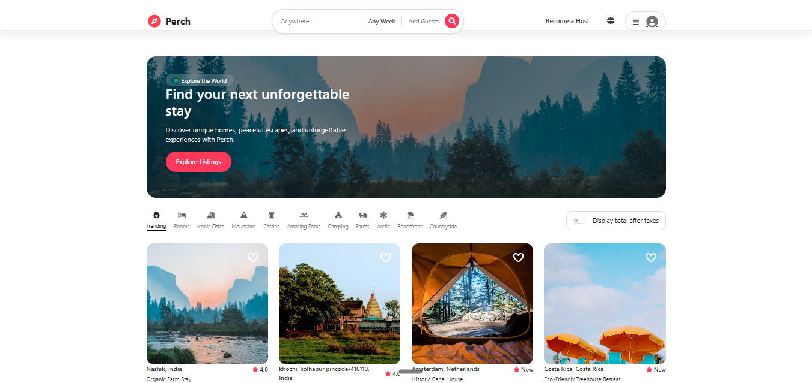

# 🏡 Perch

An Airbnb-inspired property listing platform where users can browse, search, 
and book stays — built end-to-end with a real backend, image uploads, and 
interactive maps.

**🔗 Live demo:** [wanderlust-mern-pi13.onrender.com](https://wanderlust-mern-pi13.onrender.com)

## Features

- 🔍 Multi-field search across listings
- 🗺️ Interactive map (Leaflet) showing listing locations
- 📸 Image uploads via Cloudinary
- ⭐ Reviews and ratings system
- 🏷️ Category-based filtering
- 🔐 User authentication & authorization
- 📱 Responsive design (mobile navbar/search included)
- 👤 User dashboard — "My Listings" management

## Tech Stack

**Backend:** Node.js, Express.js, MongoDB, Mongoose  
**Frontend:** EJS, Bootstrap, Vanilla JS  
**Auth:** Passport.js  
**Image storage:** Cloudinary  
**Maps:** Leaflet.js + geocoding  
**Deployment:** Render (backend + DB hosting), MongoDB Atlas

## Getting Started

\`\`\`bash
git clone https://github.com/sourabhshinge17/perch.git
cd perch
npm install
\`\`\`

Create a `.env` file with:
\`\`\`
MONGO_URI=your_mongodb_uri
CLOUDINARY_CLOUD_NAME=your_cloud_name
CLOUDINARY_API_KEY=your_api_key
CLOUDINARY_API_SECRET=your_api_secret
SESSION_SECRET=your_secret
\`\`\`

\`\`\`bash
npm start
\`\`\`

## What's Next

- [ ] Wishlist feature
- [ ] Host dashboard with analytics
- [ ] Booking/payment flow

---
Built by [Sourabh](https://github.com/sourabhshinge17)